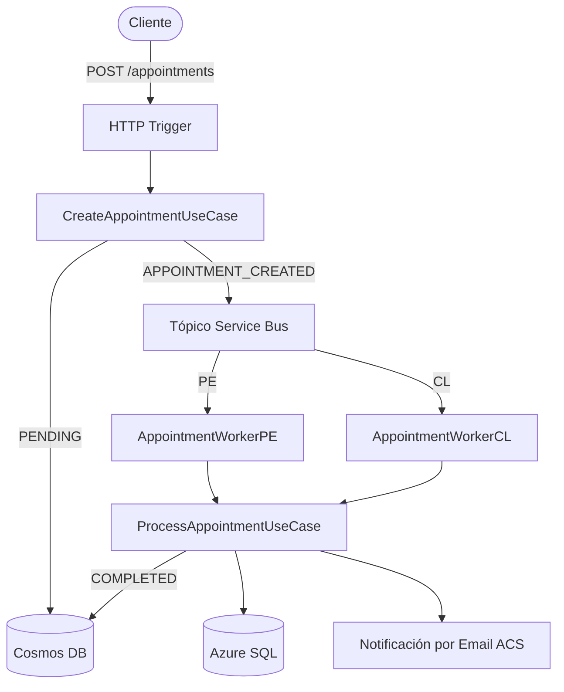

[](https://github.com/apchavez/azure-python/actions/workflows/ci.yml)
[](https://sonarcloud.io/summary/new_code?id=apchavez_azure-python)
[](https://sonarcloud.io/summary/new_code?id=apchavez_azure-python)
[](https://sonarcloud.io/summary/new_code?id=apchavez_azure-python)

# Plataforma de Agendamiento de Citas Médicas — Azure (Python)

Migración a Azure de la plataforma de citas médicas originalmente construida en AWS ([aws-typescript](https://github.com/apchavez/aws-typescript), TypeScript). Misma lógica de negocio y misma Clean Architecture — solo cambian los adaptadores de infraestructura (y, en esta migración, el lenguaje de implementación).

> El dominio no tiene ningún conocimiento de Azure. Lo único que cambia entre nubes es la capa de infraestructura; los casos de uso y las entidades permanecen intactos.

> **Costo cero en reposo** — el CI solo compila y corre pruebas. No se aprovisiona ningún recurso de Azure hasta que se dispara manualmente el workflow de deploy.

---

## Stack Tecnológico

| Categoría | Tecnología |
|---|---|
| Lenguaje / Runtime | Python 3.12, Azure Functions Python v2 programming model |
| Almacén de estado (NoSQL) | Cosmos DB serverless (Managed Identity) |
| Persistencia relacional | Azure SQL Database (pymssql) |
| Mensajería | Service Bus topics + subscriptions (Managed Identity) |
| Notificaciones | Azure Communication Services Email |
| Resiliencia | Circuit breaker + retry exponencial hechos a mano (replica el `shared/resilience.ts` del proyecto hermano en AWS) |
| IaC | Bicep (deployment a nivel de subscription) |
| Seguridad | Managed Identity, referencias a Key Vault, solo HTTPS |
| Observabilidad | Application Insights (vía `azure-monitor-opentelemetry`), correlation IDs (`contextvars`), logs estructurados |
| Documentación de API | OpenAPI 3.0 (validado en CI con Redocly) |
| Build / Tests | pytest, pytest-cov (gate de 80% en domain + application), ruff (lint + format) |
| CI/CD | GitHub Actions (CI automático, deploy/destroy manual) |

---

## Mapeo AWS → Azure

| AWS (proyecto original) | Azure (este proyecto) |
|---|---|
| AWS Lambda | Azure Functions v4 |
| API Gateway | HTTP trigger (+ APIM opcional) |
| DynamoDB | Cosmos DB |
| MySQL / RDS | Azure SQL Database |
| Tópico SNS | Tópico de Service Bus |
| Cola SQS | Subscription de Service Bus |
| EventBridge | Tópico de Service Bus `appointment-completed` |
| Serverless Framework | Bicep |
| CloudWatch | Application Insights + Log Analytics |

---

## Arquitectura



Clean Architecture con cuatro capas bien definidas:

```
clinic/
├── domain/
│   ├── entities/        Appointment, AppointmentEvent, AppointmentStatus, CountryISO
│   ├── ports/           AppointmentStateRepository, AppointmentRelationalRepository,
│   │                    AppointmentEventPublisher, AppointmentEventStore, AppointmentNotifier
│   │                    (typing.Protocol — tipado estructural, sin necesidad de herencia de una clase base)
│   ├── shared/          Page[T]
│   └── exceptions.py    IllegalStateError, ForbiddenError
├── application/
│   └── usecases/        create_appointment, get_appointments, get_appointment_history,
│                        process_appointment, cancel_appointment, reschedule_appointment
├── infrastructure/
│   ├── auth/            jwt_validator (HS256 hecho a mano), auth_guard
│   ├── config/          app_context (composition root), resilience, correlation_context,
│                        telemetry_context
│   ├── messaging/       service_bus_event_publisher
│   ├── notifications/   acs_appointment_notifier, no_op_appointment_notifier
│   └── repos/           cosmos_appointment_state_repository, cosmos_appointment_event_store,
│                        azure_sql_appointment_repository
└── shared/               api_response, health_status

function_app.py           Puntos de entrada de Azure Functions v2 (triggers HTTP + Service Bus)
```

**Regla de dependencia:** `infrastructure` / `function_app.py` → `application` → `domain`
El dominio no importa ningún SDK de Azure. Las pruebas corren completamente en memoria, sin necesidad de nube.

---

## Flujo de Extremo a Extremo

```
POST /api/appointments
  → CreateAppointmentUseCase
      → Cosmos DB (estado PENDING) + evento APPOINTMENT_CREATED
      → Tópico Service Bus "appointment-created"
          → AppointmentWorkerPE / AppointmentWorkerCL
              → ProcessAppointmentUseCase
                  → Cosmos DB (COMPLETED) + evento APPOINTMENT_COMPLETED
                  → Azure SQL (persistencia final)
                  → Email ACS (notificación al asegurado)
                  → Tópico Service Bus "appointment-completed"

DELETE /api/appointments/{id}             → CancelAppointmentUseCase     → CANCELLED
PATCH  /api/appointments/{id}/reschedule  → RescheduleAppointmentUseCase → RESCHEDULED + nueva cita
GET    /api/appointments/{id}/history     → log de eventos inmutable desde Cosmos DB
```

---

## Cómo Empezar

Requiere [Azure Functions Core Tools v4](https://learn.microsoft.com/azure/azure-functions/functions-run-local), Python 3.12, y una cuenta de Cosmos DB o el emulador.

```bash
# 1. Crear un venv e instalar dependencias
python -m venv .venv
.venv/Scripts/activate   # .venv/bin/activate en Linux/macOS
pip install -r requirements-dev.txt

# 2. Configurar variables (copiar y editar)
cp local.settings.json.example local.settings.json
# Completar COSMOS_ENDPOINT, SERVICEBUS__fullyQualifiedNamespace, SQL_HOST, SQL_USER, SQL_PASSWORD
# Opcionalmente configurar APPLICATIONINSIGHTS_CONNECTION_STRING para habilitar telemetría local

# 3. Iniciar
func start
```

La función estará disponible en `http://localhost:7071/api`.

Para correr solo las pruebas (sin nube, sin variables de entorno):

```bash
pytest --cov=clinic.domain --cov=clinic.application --cov-fail-under=80
```

---

## Endpoints de la API

Ruta base: `/api`

| Método | Ruta | Descripción |
|---|---|---|
| `POST` | `/appointments` | Crear cita (PENDING → Service Bus) |
| `GET` | `/appointments/{insuredId}` | Listar citas con paginación basada en cursor |
| `DELETE` | `/appointments/{appointmentId}` | Cancelar una cita PENDING |
| `PATCH` | `/appointments/{appointmentId}/reschedule` | Reprogramar una cita PENDING |
| `GET` | `/appointments/{appointmentId}/history` | Log de eventos inmutable de una cita |
| `GET` | `/health` | Estado de Cosmos DB, SQL, y Service Bus |

Contrato completo: [`src/docs/openapi.yaml`](src/docs/openapi.yaml)

Todos los endpoints excepto `/health` requieren un token JWT Bearer en el header `Authorization`:

```
Authorization: Bearer <token>
```

Los tokens son JWT **HS256** con claims `sub`/`role`/`exp` (misma forma que los tokens del proyecto hermano AWS Lambda), firmados con el secreto en `JWT_SECRET` (respaldado por Key Vault — ver [Deploy](#deploy)). La validación ocurre **dentro de la propia Function** (`auth_guard`/`jwt_validator`, `clinic/infrastructure/auth/`), no vía API Management — así que está activa sin importar si `deployApiManagement` está habilitado. Las solicitudes con un token ausente, malformado, alterado, o expirado reciben **401 Unauthorized**. `auth_level=func.AuthLevel.ANONYMOUS` en cada `@app.route` solo significa "no requiere key de Azure Functions"; no significa que no requiera autenticación.

### Generar un token (dev/testing)

```bash
# JWT HS256 con header {"alg":"HS256","typ":"JWT"} y payload {"sub":"agent-001","role":"agent","exp":<unix-ts>}
# codificar header y payload en base64url (sin padding), luego aplicar HMAC-SHA256 al string "header.payload" con JWT_SECRET
```

No hay endpoint de login en este proyecto de portafolio (igual que el hermano AWS Lambda) — generá un token con cualquier librería/script JWT HS256 usando el valor de `JWT_SECRET` de Key Vault, o reutilizá el helper `signJwt` del proyecto AWS (`src/infra/jwt.ts`) ya que ambos aceptan la misma forma de token.

---

## OpenAPI

El contrato completo de la API está en [`src/docs/openapi.yaml`](src/docs/openapi.yaml) — **OpenAPI 3.0.3** con schemas completos de request/response, ejemplos, y códigos de error para los 6 endpoints. El spec se valida automáticamente en cada corrida de CI con Redocly (`ci.yml`).

**Validar localmente:**

```bash
npx @redocly/cli lint src/docs/openapi.yaml
```

**Generar documento HTML estático:**

```bash
npx @redocly/cli build-docs src/docs/openapi.yaml -o docs/swagger.html
```

---

## Testing

```bash
pip install -r requirements-dev.txt
ruff format --check .
ruff check .
pytest --cov=clinic.domain --cov=clinic.application --cov-fail-under=80
```

Las pruebas corren completamente en memoria -- no requieren cuenta de Azure, variables de entorno, ni conexión de red.

| Tipo | Alcance | Descripción |
|---|---|---|
| Unitarias | Domain & Application | Casos de uso y entidades con fakes en memoria escritos a mano -- cero dependencias de Azure |
| Unitarias | Infrastructure & API | Adaptadores y handlers HTTP probados con clientes de SDK de Azure simulados (`unittest.mock`) |

`pytest-cov` exige **>= 80% de cobertura** solo en `clinic.domain` y `clinic.application`. Los adaptadores de infraestructura que requieren conexiones reales a Azure quedan excluidos del umbral.

---

## Deploy

El deploy es **exclusivamente manual** vía GitHub Actions (`workflow_dispatch`). El CI nunca aprovisiona recursos de Azure.

```
.github/workflows/
├── ci.yml          Push/PR → build, tests, validación de OpenAPI   (sin costo en Azure)
├── deploy.yml      Manual  → infra Bicep + Function App            (genera costo)
├── destroy.yml     Manual  → elimina el resource group             (detiene el costo)
├── cost-guard.yml  Diario  → ejecuta destroy.yml automáticamente si el RG de dev tiene más de 48h
└── integration.yml Manual  → pruebas de Postman contra el entorno en vivo
```

Para hacer deploy a Azure, configurá las variables de entorno OIDC (`AZURE_CLIENT_ID`, `AZURE_TENANT_ID`, `AZURE_SUBSCRIPTION_ID`) y los secrets `SQL_ADMIN_PASSWORD`/`JWT_SECRET` en el repositorio.

`cost-guard.yml` no necesita ser disparado — corre todos los días, revisa la fecha de creación de `rg-clinic-dev` vía Azure Resource Graph, y dispara `destroy.yml` automáticamente si tiene más de 48h (configurable con `max_age_hours` en una corrida manual). No hace nada si el resource group no existe. Mismo patrón que los hermanos `aws-typescript`/`gcp-go`.

> **Nota de diseño — `allowPublicNetworkAccess` es `true` por defecto.** Cosmos DB, Service Bus, Storage, Azure SQL, y Key Vault son alcanzables desde internet público por defecto (`infra/core.bicep`). Esto es una decisión deliberada, no un descuido: ninguno de estos templates de Bicep aprovisiona una VNet, subnets, o Private Endpoints, así que cambiar el default a `false` haría que ningún recurso sea alcanzable por la Function App en un deploy por defecto — el networking privado es una adición real de infraestructura (VNet + Private Endpoints + zonas de Private DNS por servicio + integración de la Function App a la VNet), fuera del alcance de un deployment del tamaño de un portafolio. Configurá `allowPublicNetworkAccess=false` solo después de agregar esa capa de networking vos mismo.

---

## Observabilidad

| Señal | Implementación |
|---|---|
| Logging estructurado | `python-json-logger` — todos los handlers emiten JSON a stdout, capturado automáticamente por Application Insights |
| Tracing / correlación | `azure-monitor-opentelemetry` correlaciona logs, dependencias, y excepciones entre invocaciones; el correlation ID se propaga vía `contextvars` |
| Health check | `GET /api/health` — hace ping a Cosmos DB, Azure SQL, y Service Bus; devuelve `UP`/`DOWN` por componente |
| Alertas de métricas | Bicep aprovisiona dos alertas de Azure Monitor cuando se despliega con `deployAlerts=true` y `alertEmail`: **tasa de errores 5xx** (severidad 2) y **latencia alta** (severidad 3, promedio > 2 s) |

Para habilitar las alertas durante el deploy, pasá los parámetros al workflow de deploy:

```bash
gh workflow run deploy.yml -f deployAlerts=true -f alertEmail=you@example.com
```

---

## Qué Demuestra Este Proyecto

- Clean Architecture portable entre nubes *y* lenguajes — las capas de domain/application se migraron de Java a Python sin ninguna desviación en la lógica de negocio
- Servicios nativos de Azure: event sourcing con Cosmos DB, fan-out con Service Bus, notificaciones por email con ACS
- Managed Identity en todas partes — ninguna credencial hardcodeada en todo el código
- Circuit breaker + retry exponencial hechos a mano (migrados línea por línea desde el `resilience.ts` del hermano AWS TypeScript) en todas las llamadas externas
- Paginación basada en cursor sobre Cosmos DB para result sets grandes
- IaC con Bicep a nivel de subscription — todo el stack se aprovisiona en un solo workflow
- Contrato OpenAPI validado en cada corrida de CI con Redocly
- Diseño de CI con costo cero — el pipeline de CI no crea ningún recurso de Azure

---

## Proyectos Relacionados

Este repo va en conjunto con **aws-typescript** y **gcp-go**: los tres implementan el mismo dominio de agendamiento de citas médicas y Clean Architecture, mismos 5 endpoints, distinta nube/lenguaje — mantenidos en paridad funcional a propósito. Los cuatro proyectos fullstack de Kubernetes forman un segundo grupo así, compartiendo en cambio un dominio de Gestión de Productos.

| Proyecto | Descripción |
|---|---|
| [aws-typescript](https://github.com/apchavez/aws-typescript) | La versión original en AWS — TypeScript, Lambda, DynamoDB, SNS/SQS. Misma lógica de dominio, distinta nube |
| [gcp-go](https://github.com/apchavez/gcp-go) | Mismo dominio de agendamiento de citas médicas, escrito en Go sobre GCP Cloud Run con Clean Architecture |
| [quarkus-react](https://github.com/apchavez/quarkus-react) | Plataforma de Gestión de Productos — backend Quarkus, frontend React, MongoDB, Redis, eventos Kafka, Kubernetes |
| [spring-webflux-angular](https://github.com/apchavez/spring-webflux-angular) | Mismo dominio de Gestión de Productos, backend reactivo Spring Boot WebFlux, frontend Angular, PostgreSQL, Kafka, Kubernetes |
| [spring-mvc-angular](https://github.com/apchavez/spring-mvc-angular) | Mismo dominio de Gestión de Productos y frontend Angular que spring-webflux-angular, backend clásico bloqueante Spring MVC, Spring Data JDBC, Kafka, Kubernetes |
| [net-vue](https://github.com/apchavez/net-vue) | Mismo dominio de Gestión de Productos, backend ASP.NET Core, frontend Vue 3, PostgreSQL, Kafka, Kubernetes |
---

## Licencia

[MIT](LICENSE)
